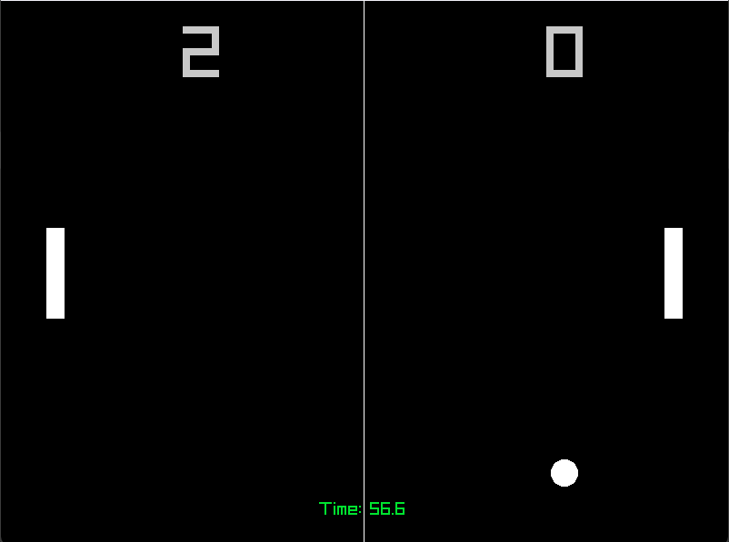

# 🏓 PINGPONG (Raylib C++)

A polished, "juicy" clone of the classic arcade game Pong, built from scratch using **C++** and the **Raylib** library. 

This project demonstrates the use of a **Finite State Machine (FSM)** to manage game states (Splash, Countdown, Gameplay, Ending), along with audio management and visual polish effects.



## ✨ Features

* **Finite State Machine Architecture:** Clean separation between Splash Screen, Countdown, Gameplay, and Game Over.
* **Visual Polish:**
    * Smooth fade-in effects on the splash screen.
    * Retro "flickering" text effect on start.
    * Countdown timer before the round starts.
* **Audio System:**
    * Dynamic background music (intro music vs gameplay music).
    * Sound effects for paddle hits, wall bounces, and scoring.
* **Two-Player Local Co-op.**

## 🎮 Controls

| Action | Key |
| :--- | :--- |
| **Start Game** | `SPACE` |
| **Player 1 (Left)** | `W` (Up) / `S` (Down) |
| **Player 2 (Right)** | `UP ARROW` / `DOWN ARROW` |
| **Restart (Game Over)** | `ENTER` |

## 🛠️ How to Build

To compile this game, you need a C++ compiler (like MinGW/G++) and the Raylib library linked.

### Build Command (MinGW)
Run the following command in your terminal:

```bash
g++ main.cpp -o PingPong.exe -O2 -Wall -Wno-missing-braces -I include -L lib -lraylib -lopengl32 -lgdi32 -lwinmm -mwindows
